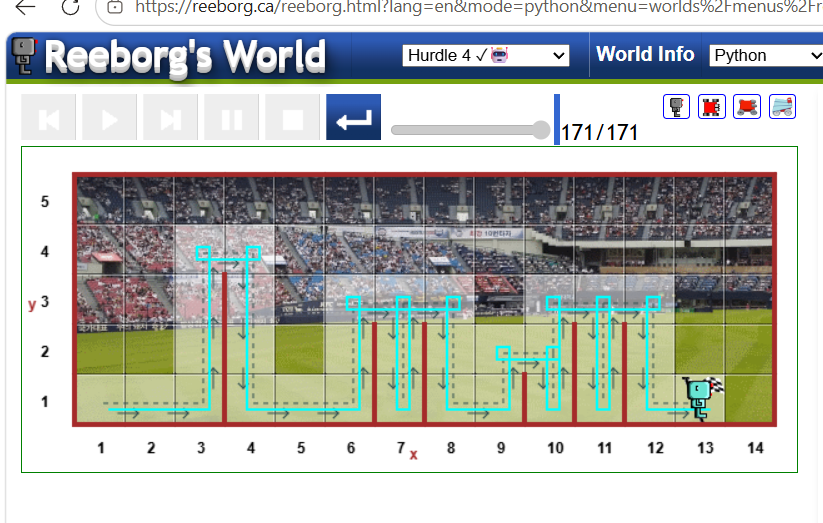

# Hurdle 4

## Description

Hurdle 4 is a Python-based Karel programming challenge. The program makes the robot jump over hurdles and continue moving until it reaches the goal.

## Code

```python
def turn_right():
    turn_left()
    turn_left()
    turn_left()

def jump():
    turn_left()
    while wall_on_right():
        move()
    turn_right()
    move()
    turn_right()
    while front_is_clear():
        move()
    turn_left()

while not at_goal():
    if wall_in_front():
        jump()
    elif front_is_clear():
        move()
```

## Concepts Used

* Functions
* `while` loop
* `if` / `elif`
* Conditional statements
* Robot movement
* Wall detection
* Hurdle navigation

## Output

### Output Screenshot



### Output Video

[▶️ View Hurdle 4 Execution Video](hurdle4.mp4)

## Result

The robot successfully crossed all the hurdles and reached the goal.

**Hurdle 4 completed successfully. ✅**
