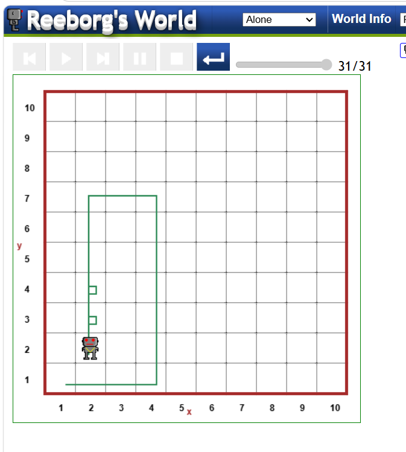

# 🤖 Reeborg's World – Python Practice

## 📌 Project Overview

This project contains a Python program created and practiced using **Reeborg's World**.

The program controls the Reeborg robot using movement commands, turning commands, and a user-defined function.

## 🐍 Python Code

move()
move()
move()
turn_left()
move()
move()
move()

def turn_right():
    turn_left()
    turn_left()
    turn_left()
    turn_left()

move()
move()
move()
turn_left()
move()
move()
turn_left()
move()
move()
turn_right()
move()
turn_right()
move()

## 🎯 Concepts Practiced

- Python functions
- `move()` command
- `turn_left()` command
- Creating a custom `turn_right()` function
- Sequential execution
- Robot navigation
- Problem solving using Python

## 🛠️ Tool Used

- **Reeborg's World**
- **Python**

## 🖥️ Output Screenshot

The following screenshot shows the Reeborg environment and Python program.

## 🎥 Program Execution Video

The video demonstrates the Reeborg robot executing the Python program.

[▶️ Watch the Program Execution Video](output.mp4)

## 📂 Project Files

| File | Description |
|---|---|
| `README.md` | Project documentation |
| `output.png` | Reeborg's World output screenshot |
| `output.mp4` | Program execution video |

## 📚 Learning Outcome

Through this practice, I learned how to control a robot using Python commands and how to create reusable functions for movement.

## 👩‍💻 Author

**Sneha S.**
